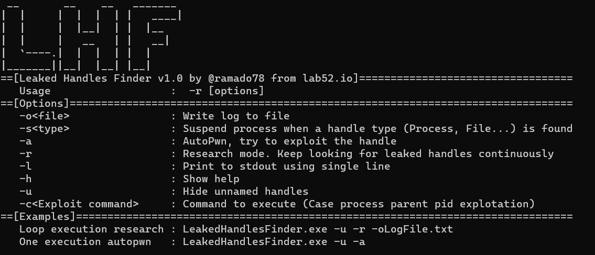
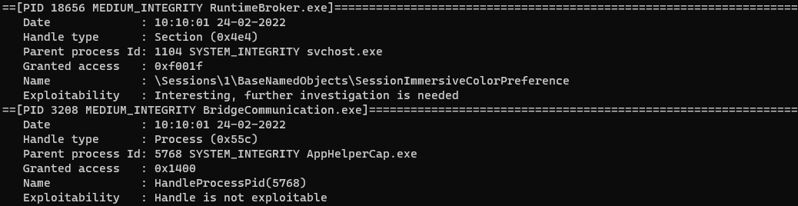

# LHF - Leaked Handles Finder
Leaked Windows processes handles identification tool. Useful for identify new LPE vulnerabilities during a pentest or simply as a new research process. 
Currently supports exploiting (autopwn) procesess leaked handles spawning a new arbitrary process (cmd.exe default).

LHF identifies in realtime inherited handles and gives the researcher explotability tips

Presented at rootedcon 2022 https://www.rootedcon.com/ponentes-rooted2022/.

Presentation -> Presentation/Exploiting Leaked Handles for LPE.pdf
